# Entorno de desarrollo web para PHP


### Contenedores

| Servicio         | Version | Puertos   |
|------------------|---------|-----------|
| PHP 8.2 + Apache | 8.2     | 8000:80   |
| PHP 7.4 + Apache | 7.4     | 8001:80   |
| Composer         | 2       | -         |
| MariaDB          | Latest  | 3306:3306 |


### Docker


#### ¿Como puedo ejecutar este proyecto? 

Para poder ejecutar este repositorio y poder empezar a desarrollar en PHP deberás ejecutar el siguiente
comando en el directorio raíz.

```cmd
docker compose up -d
```

- **docker compose up** : Inicia los contenedores alojados en el archivo docker-compose.yml
- **-d** : Ejecuta los contenedores en segundo plano.

Con este comando se empezarán a crear los contenedores antes mencionados (si pones el comando con los contenedores ya creados lo único que hace es iniciarlos cogiendo los cambios). Luego de esta primera ejecución podrás encender los 
contendores de manera normal en el Docker Desktop

#### Como detengo los contenedores?

Para detener los contenedores puedes hacerlo directamente en la aplicación **Docker Desktop** en el botón de detener.

Hay otras dos maneras, pero son mediante terminal: 

1. Abre una terminal en el directorio raíz del proyecto (a la altura del **docker-compose.yml** y del **Dockerfile**), pones el comando ```docker compose down```. Esto **eliminará** todos los contenedores que estén asociados a ese *docker-compose.yml*.
2. Abre una terminal y escribes ```docker down (nombre_contenedor o id_contenedor)```

#### Donde empiezo a programar?

Para empezar tu aplicación y poder programar deberás trabajar en la carpeta **app**.

Ya que esta es la carpeta que los dos servicios de PHP (PHP 8.2 y PHP 7.4) sirven la web.

Básicamente montamos la carpeta **app** en **/var/www/html** la carpeta por defecto de Apache para servir las webs.


#### Como maneja Docker los puertos y las conexiones?

##### Puertos

En Docker podemos cambiar los puertos que exponemos para conectarnos, por ejemplo, en este repositorio en **PHP 8.2** tenemos esta configuración

```yml
ports:
  - "8000:80"
```


Lo que quiere decir que de manera interna el **PHP 8.2** funciona con el puerto 80 (él por defecto para Apache) pero para conectarnos de manera externa a la web deberemos usar el 8000, por ejemplo ``` http://localhost:8000 ```. 

##### Conexiones

En nuestra aplicación usaremos de manera frecuente conexiones a nuestra base de datos **MariaDB**, así que es importante explicar como manejar estas conexiones en nuestro entorno **Docker**.

A diferencia de Xamp, en Docker no nos podemos conectar a la base de datos con **PHP** mediante el hostname **localhost**, ya que Docker tiene un servidor DNS interno distinto. Lo recomendable es usar el conector interno de Docker, usando el hostname **host.docker.internal**.

> Archivo config.ini

```ini
[database]
hostname = "host.docker.internal"
puerto = "3306"
usuario = "root"
contrasena = "root"
base_de_datos = "dwcs"
```
Pero de manera externa, sí podremos conectarnos mediante **localhost** por ejemplo, para usar algún gestor de base de datos, como MySQL Workbench o DataGrip.

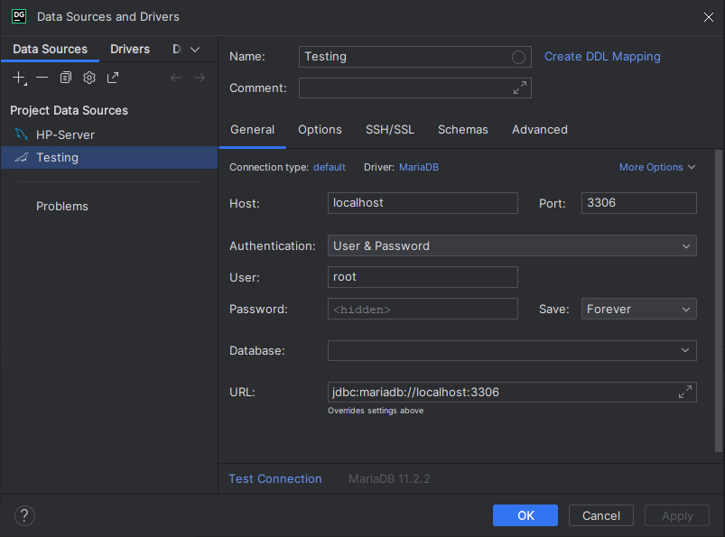

En resumen, para conexiones internas entre los contenedores usar el puerto interno y el hostname **host.docker.internal**, para conexiones externas usar el puerto que expone docker y el hostname **localhost**.

#### Volúmenes

En el repositorio tenemos creados varios volúmenes importantes.

- MariaDB Volumen: ./data:/var/lib/mysql | Este volumen es el encargado de guardar los datos de la base de datos, para evitar perder la información cada vez que apagamos el contenedor.
- PHP 8.2 y 7.2:
  - ./app:/var/www/html | Volumen que monta la web para servirla mediante el servidor Apache
  - ./config/php.ini:/usr/local/etc/php/php.ini | Montar el archivo de configuración php.ini en el servidor para poder editarlo mas facil
- Composer: ./app:/var/www/html | Donde se monta la instalación del composer. (Carpeta **./vendor**, composer.json, composer.lock)

#### ¿Errores?

A lo largo del desarrollo en este entorno es posible que al reconstruir nuestros proyectos (```docker compose up --force-recreate --build -d```) tantas veces ocurran algunos errores, o sean por otros motivos, dejo aquí unas soluciones a algunos errores que me han ido saliendo.

1. SQLState could not find driver

Este error se da porque en nuestro contenedor no se instaló bien el pdo_mysql.

2. Error al cargar alguno de los servicios en la web

La solucion suele ser eliminar los contenedores y volver a construirlos.

Para solucionarlo debemos instalarlo de manera manual, primero debemos ejecutar la consola de nuestro contenedor con ```docker exec -it "nombreContenedor" /bin/bash ```

Ya con la consola abierta podemos ejecutar el comando para instalarlo ```docker-php-ext-install mysqli pdo_mysql ```, 
ya con esto se instala y ahora solo queda habilitarlo ```docker-php-ext-enable mysqli pdo_mysql```. Ahora solo queda reiniciar el contenedor.

### Composer

#### ¿Que es Composer?

Composer es una herramienta para administrar las dependencias en proyectos de PHP. 
En términos simples, ayuda a gestionar las bibliotecas y paquetes de código que tu proyecto PHP pueda necesitar para funcionar.

#### Como usarlo? 

Para poder usar composer e instalar la librerías que necesitemos lo haremos desde el Docker llamado **mycomposer**.

A modo de ejemplo, mostraré como instalar Krumo (Una herramienta para visualizar mejor los vardump() ) -> https://packagist.org/packages/mmucklo/krumo

1. Entraremos dentro del contenedor **mycomposer** con el siguiente comando.

``` docker exec -it mycomposer /bin/bash ```

Se nos abrirá una consola nueva, esta es la consola interna del contenedor **mycomposer**.

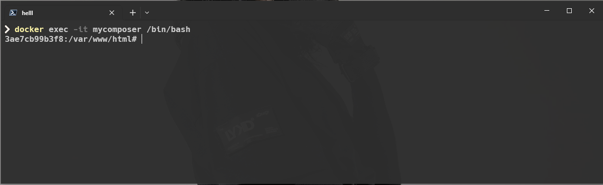

2. Ponemos el comando para instalar el paquete que queramos, en nuestro caso es Krumo el paquete.

``` composer require mmucklo/krumo```

Con esto comenzará la instalación de nuestro paquete.

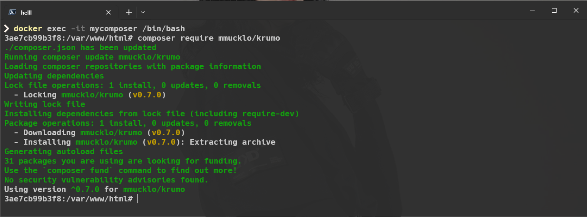

3. Con nuestro paquete instalado es muy recomendable ejecutar el siguiente comando para refrescar el script encargado de cargar la librerías (dentro de la consola de **mycomposer**).

``` composer dump-autoload ```

4. Ya con nuestro paquete instalado solo queda probarlo, dejo aquí un código simple para probarlo.

```php
include('./vendor/autoload.php');

$variable = array('a' => 'apple', 'b' => 'banana', 'c' => 'cherry');
krumo($variable);
```

#### Errores 

1. Solucion de errores de bibliotecas copiadas

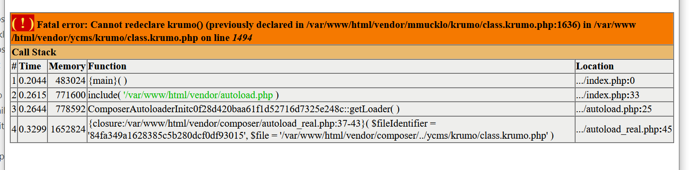

Se soluciona eliminando la biblioteca y haciendo 
```composer dump-autoload```

#### ¿Como funciona Composer?

De una manera simple, Composer usa un archivo llamado **autoload.php**, el cual se encarga de cargar todas las librerías y que puedas usarlas en tus scripts.

Para usar las librerías deberás escribir obligatoriamente en el fichero la siguiente línea:

```php 
include('./vendor/autoload.php');
```

Así de esta manera se cargarán todas las librerías y las podrás usar. 
Una buena práctica es que cada vez que descarguemos una librería ejecutemos el comando del paso 3, 
del anterior apartado anterior para actualizar el script que autocarga las librerías. 

### XDebug

#### ¿Que es XDebug?

#### XDebug en VSCode

Para poder usar el xdebug en el VSCode es necesario configurar los parámetros de lanzamiento de la sesión de `Debugging`.

Estos parámetros se encuentran en la carpeta oculta **./.vscode** en el archivo **launch.json**. Los parámetros más importantes son los siguientes: 

- Puerto del XDebug `"port": 9003`, este es el puerto por defecto que se usa para la sesión del XDebug
- Ruta de Mapeo del proyecto `"pathMappings": { "/var/www/html/": "${workspaceRoot}/app/" }`, esta configuración define la ruta para el servidor de depuración. Si se cambia el nombre de la carpeta del proyecto es importante volver a cambiarlo aquí.
- Directorio de trabajo `cwd": "${workspaceFolder}/app/"`, aquí se establece el directorio donde está alojado el proyecto.

Por suerte en este repositorio ya viene configurado el launch.json, pero recuerda que si realizas alguna modificación es relevante volver a reflejarlas en el **launch.json**

Aparte de esto es relevante descargar la siguiente extensión.

- PHP Debug -> https://marketplace.visualstudio.com/items?itemName=xdebug.php-debug (Nos permite colocar los puntos de interrupción en nuestro código PHP)

##### ¿Como inicion una sesión con XDebug?

Para empezar a realizar una sesión de depuración con XDebug deberás seguir estos pasos.

1. Poner el **Breakpoint**

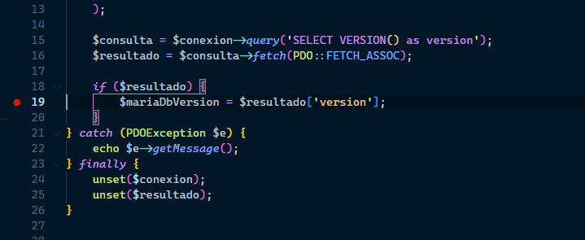

2. Entrar en el apartado de Run and Debug (Ctrl+Shift+D) y hacer click en XDebug

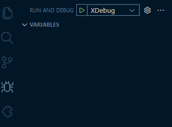

Tras hacer click nos saldrá abajo que el XDebug está escuchando en puerto 9003

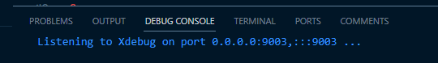

3. Ya con el XDebug escuchando solo queda ** abrir nuestra web ** y ya podremos ver la sesión de depuración funcionando, si la web ya esta en ejecucion solo es ** recargar la página **.

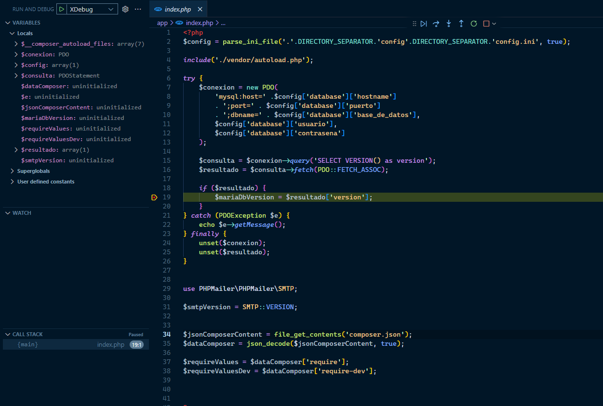


#### XDebug en NetBeans

Para configurar nuestro entorno en Netbeans es algo más complicado que en Vscode.

Primero debemos cargar nuestro proyecto en NetBeans. 

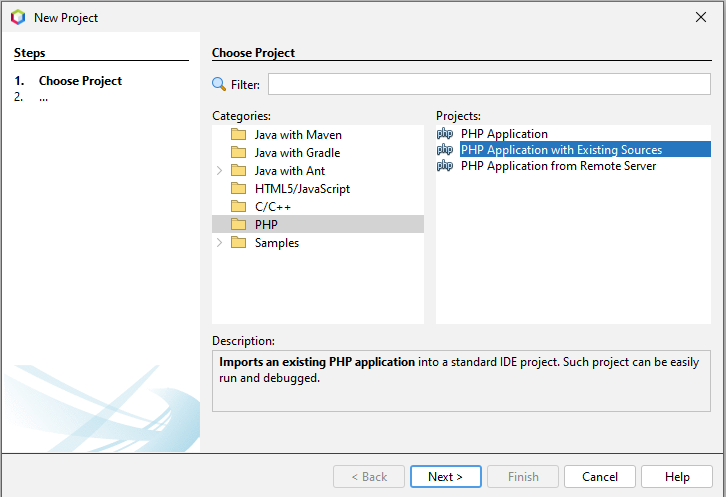

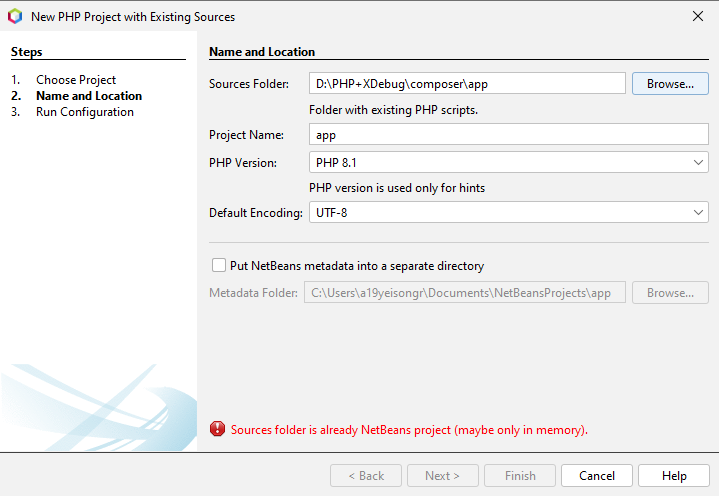

Aquí es importante poner como carpeta del proyecto la misma que montamos en nuestro docker, en este caso la carpeta **app**


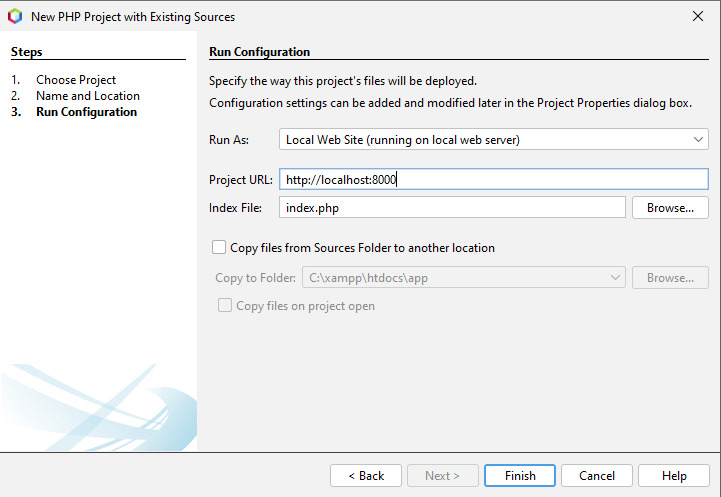

Por último no olvidarse de poner bien nuestra URL del proyecto, cuidando especificar el puerto, como en nuestro caso tenemos un PHP 8.2 en el puerto 8000 debemos cambiar el puerto ```http://localhost:8000```

Con esto ya tenemos el nuestro proyecto configurado en Netbeans, con la configuración por defecto del Netbeans debería de funcionar sin problemas la depuración.

##### No me funciona el XDebug :(


En el caso de que no funcione, explico aquí como solucionarlo:

- El principal problema para que NetBeans no detecte bien nuestro XDebug es porque la **xdebug.idekey** este mal configurado.

La **xdebug.idekey**  es una opción utilizada por XDebug para especificar la clave del entorno de desarrollo integrado (IDE, por sus siglas en inglés) que está siendo utilizada. 
Esta se especifica en el **php.ini** que en el caso de este repositorio está alojada en la carpeta **./composer/config** 

```ini
xdebug.client_port=9003
xdebug.idekey="netbeans-xdebug"
```

Aquí la especificamos como "netbeans-xdebug", que es la idekey por defecto de NetBeans.

Así que lo que tenemos que hacer es comprobar que esta coincida tanto en NetBeans como en el **php.ini**, para verlo en el NetBeans tienes
que acceder a **Tools>Options**. Se abrira la siguiente pestaña e iremos a **PHP** y **Debugging**.

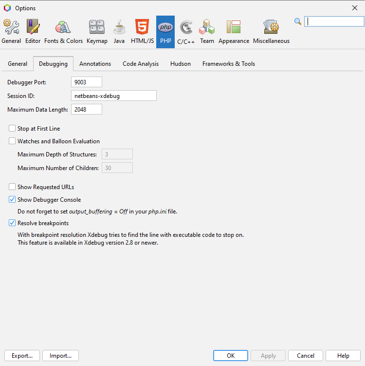

Aquí comprobamos la Session ID, y también el puerto (es el 9003).